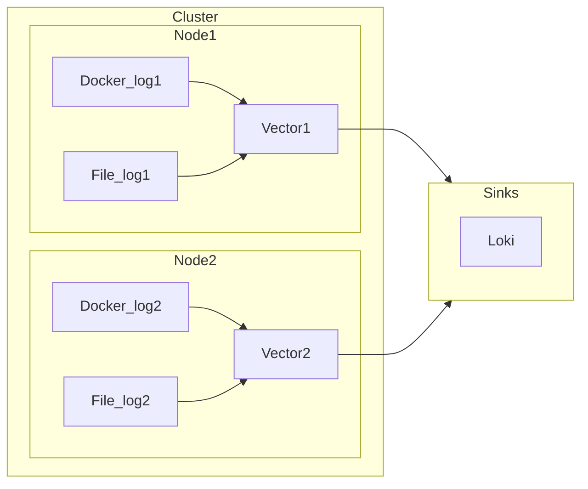

Log system
=========

Deploy vector, loki and grafana by docker. 

Requirements
--------------

1. Set your inventory directory

   ```bash
   inventory
   ├── sample
   │   ├── group_vars
   │   │   └── logsystem.yml
   │   └── inventory.ini
   ```

2. Edit `inventory.ini`

   ```ini
   [all]
   node1 ansible_host=10.0.0.1
   node2 ansible_host=10.0.0.2
   
   [aggregator]
   node1
   
   [agent]
   node2
   
   [logsystem:children]
   aggregator
   agent
   
   ```

Role Variables
--------------

- `log_system_path` - Log system config and data directory
- `is_agent` - Whether it is the agent role of the log system
- `vector_persisting_volumes` - Directory for vector collecting host logs
- `vector_api_enabled` - Open or close the vector api
- `vector_sources_configs` - Vector sources config for observability data
- `vector_transforms_configs` - The vector component transforms config
- `vector_sinks_configs` - The vector destinations config for observability data
- `loki_server_port` - Loki server port
- `loki_table_manager.retention_deletes_enabled` - If true, enables retention deletes of DB tables
- `loki_table_manager.retention_period` - Tables older than this retention period are deleted.
- `loki_labels` - Reverse proxy labels
- `traefik_additional_arguments` - Traefik additional startup arguments
- `traefik_prots` - Traefik container port mapping
- `grafana_labels` - Reverse proxy labels

> ❗️Configuration reference:
>
> - [Configuring Vector](https://vector.dev/docs/reference/configuration/)
> - [Grafana Loki configuration parameters](https://grafana.com/docs/loki/latest/configure/)

Example Playbook
----------------

```yaml
---
- name: 部署 aggregator
  hosts: aggregator
  roles:
     - logsystem

- name: 部署 agent
  hosts: agent
  roles:
     - logsystem
```

Deployment topologies
-----------------------



